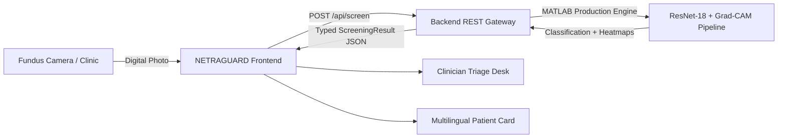

# NETRAGUARD AI

> **Explainable AI for Accessible Diabetic Retinopathy Screening**  
> *Bringing intelligent retinal screening closer to communities that need it most.*

---

## 👁️ Project Overview

**NETRAGUARD AI** is a clinical decision-support web platform engineered for early diabetic retinopathy (DR) triage in resource-constrained settings—such as Primary Health Centers (PHCs), Community Health Centers (CHCs), and mobile tele-ophthalmology vans across rural India.

This frontend application is designed to serve as the user interface and clinical workstation for an existing deep learning pipeline developed in MATLAB (ResNet-18 classification and Grad-CAM explainability).

---

## 🏗️ Decoupled Architectural Design



### Architectural Principles Adhered To:
1. **Clean Separation of Concerns:** No medical predictions, image preprocessing, or neural calculations are executed in the browser client.
2. **Dedicated Service Boundary:** `src/services/screeningApi.ts` implements standard API contracts for backend integration without coupling React components to MATLAB scripts.
3. **Explicit Boundary Verification:** The frontend explicitly flags when the MATLAB production server is not yet bridged (`POST /api/screen`).
4. **Isolated Preview/Demo Sandbox:** `src/data/demoData.ts` is explicitly marked as `DEVELOPMENT ONLY — NOT REAL MEDICAL OUTPUT` for SIH evaluation without polluting production types.

---

## 🌐 Future Backend Integration Contract

When connecting the live MATLAB pipeline via the backend REST service:

### Endpoint:
`POST /api/screen`

### Request (`multipart/form-data`):
- `image`: Retinal fundus image (JPG, JPEG, PNG)
- `patientId`: Optional unique patient identifier
- `centerLocation`: Optional PHC/center name

### Response Schema:
```json
{
  "id": "SCR-2026-0842",
  "patientId": "PT-KA-9402",
  "prediction": "Moderate Non-Proliferative DR",
  "class": 2,
  "confidence": 0.924,
  "referable": true,
  "imageQuality": {
    "status": "Adequate",
    "focusScore": 0.94,
    "illuminationScore": 0.89,
    "fieldCoverageScore": 0.95,
    "artifactsDetected": false,
    "notes": "Macular center and optic disc clearly resolved."
  },
  "processedImageUrl": "/api/artifacts/processed_SCR-2026-0842.png",
  "gradCamImageUrl": "/api/artifacts/gradcam_SCR-2026-0842.png",
  "timestamp": "2026-09-26T10:14:00Z"
}
```

---

## 🚀 Key Features

- **Fundus Intake Portal:** Drag-and-drop file uploader with size validation (up to 20MB), JPG/PNG format checks, and real-time previews.
- **Explainability Viewer (`<ExplainabilityViewer />`):** Side-by-side and interactive blend slider to inspect Grad-CAM activation heatmaps directly on retinal landmarks.
- **Image Quality Awareness:** Automated metrics tracking focus sharpness, illumination uniformity, and field-of-view coverage.
- **Doctor Clinical Workspace:** Comprehensive triage dashboard with summary metrics, patient registry table, and doctor review sign-offs.
- **Accessible Patient-Friendly Guidance:** Non-technical patient card translating medical findings into actionable advice.
- **Multilingual System:** Native translations in English, Hindi (हिन्दी), and Kannada (ಕನ್ನಡ), with an extensible architecture ready for Tamil, Telugu, and Bengali.

---

## 🛡️ Medical Disclaimer & Clinical Safety

NETRAGUARD AI is designed solely as an assistive clinical decision-support tool. It **does NOT** provide definitive medical diagnoses, guarantee clinical outcomes, or replace examination by a certified ophthalmologist.

---

## 💻 Tech Stack

- **Framework:** React 19 + TypeScript + Vite
- **Styling:** Tailwind CSS v4 with bespoke medical theme tokens
- **Typography:** Plus Jakarta Sans & JetBrains Mono (Google Fonts)
- **Icons:** Lucide React
- **Target Backend:** Python/Node REST API ↔ MATLAB Image Processing & Deep Learning Toolboxes

---

## 🏃 Getting Started

### Development:
```bash
npm install
npm run dev
```

### Production Build:
```bash
npm run build
```
